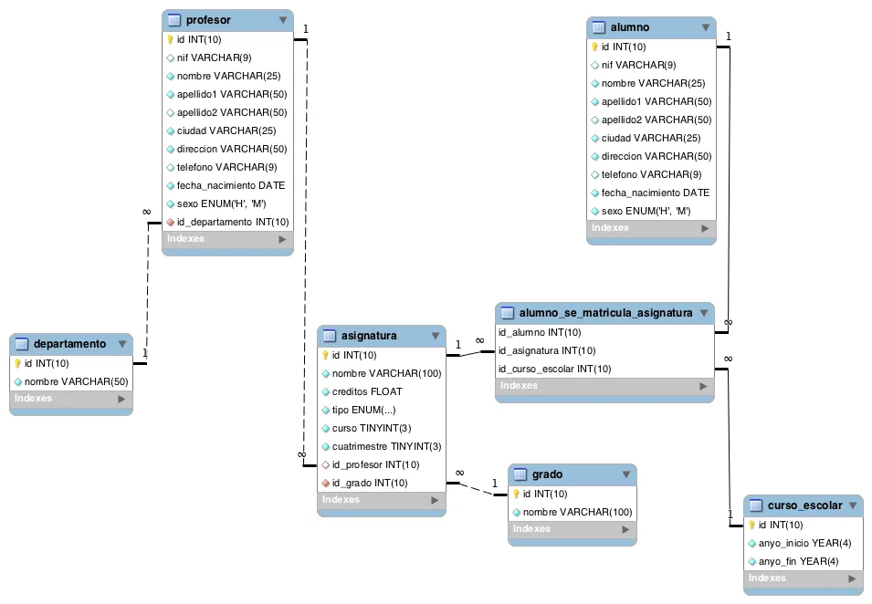

# Consultas a realizar

1. Devuelve un listado con los nombres de **todos** los profesores y los departamentos que tienen vinculados. El listado también debe mostrar aquellos profesores que no tienen ningún departamento asociado. El listado debe devolver cuatro columnas, nombre del departamento, primer apellido, segundo apellido y nombre del profesor. El resultado estará ordenado alfabéticamente de menor a mayor por el nombre del departamento, apellidos y el nombre.

2. Devuelve un listado con los profesores que no están asociados a un departamento.

3. Devuelve un listado con los departamentos que no tienen profesores asociados.

4. Devuelve un listado con los profesores que no imparten ninguna asignatura.

5. Devuelve un listado con las asignaturas que no tienen un profesor asignado.

6. Devuelve un listado con todos los departamentos que tienen alguna asignatura que no se haya impartido en ningún curso escolar. El resultado debe mostrar el nombre del departamento y el nombre de la asignatura que no se haya impartido nunca.

7. Devuelve el número total de **alumnas** que hay.

8. Calcula cuántos alumnos nacieron en `1999`.

9. Calcula cuántos profesores hay en cada departamento. El resultado sólo debe mostrar dos columnas, una con el nombre del departamento y otra con el número de profesores que hay en ese departamento. El resultado sólo debe incluir los departamentos que tienen profesores asociados y deberá estar ordenado de mayor a menor por el número de profesores.

10. Devuelve un listado con todos los departamentos y el número de profesores que hay en cada uno de ellos. Tenga en cuenta que pueden existir departamentos que no tienen profesores asociados. Estos departamentos también tienen que aparecer en el listado.

11. Devuelve un listado con el nombre de todos los grados existentes en la base de datos y el número de asignaturas que tiene cada uno. Tenga en cuenta que pueden existir grados que no tienen asignaturas asociadas. Estos grados también tienen que aparecer en el listado. El resultado deberá estar ordenado de mayor a menor por el número de asignaturas.

12. Devuelve un listado con el nombre de todos los grados existentes en la base de datos y el número de asignaturas que tiene cada uno, de los grados que tengan más de `40` asignaturas asociadas.

13. Devuelve un listado que muestre el nombre de los grados y la suma del número total de créditos que hay para cada tipo de asignatura. El resultado debe tener tres columnas: nombre del grado, tipo de asignatura y la suma de los créditos de todas las asignaturas que hay de ese tipo. Ordene el resultado de mayor a menor por el número total de crédidos.

14. Devuelve un listado que muestre cuántos alumnos se han matriculado de alguna asignatura en cada uno de los cursos escolares. El resultado deberá mostrar dos columnas, una columna con el año de inicio del curso escolar y otra con el número de alumnos matriculados.

15. Devuelve un listado con el número de asignaturas que imparte cada profesor. El listado debe tener en cuenta aquellos profesores que no imparten ninguna asignatura. El resultado mostrará cinco columnas: id, nombre, primer apellido, segundo apellido y número de asignaturas. El resultado estará ordenado de mayor a menor por el número de asignaturas.

16. Devuelve todos los datos del alumno más joven.

17. Devuelve un listado con los profesores que no están asociados a un departamento.

18. Devuelve un listado con los departamentos que no tienen profesores asociados.

19. Devuelve un listado con los profesores que tienen un departamento asociado y que no imparten ninguna asignatura.

20. Devuelve un listado con las asignaturas que no tienen un profesor asignado.

# Diagrama E-R:

